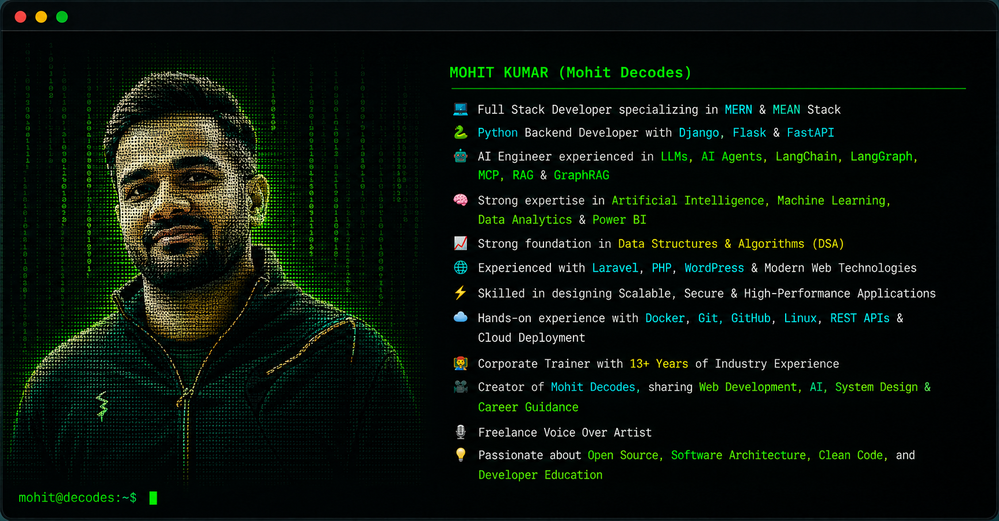

<h1 align="center">Hi 👋, I'm Mohit Kumar</h1>

Full Stack Developer • AI Engineer • Tech Architect • Corporate Trainer

---

# 🌐 Connect With Me

---

# 💻 Programming Languages

---

# 🎨 Frontend Development

---

# ⚙️ Backend Development

---

# 🗄️ Databases

---

# ☁️ DevOps & Cloud

---

# 🛠️ Tools & IDEs

---

# 🤖 AI & Data Technologies

- 🧠 Artificial Intelligence (AI)
- 🤖 Machine Learning (ML)
- 🧩 Large Language Models (LLMs)
- 🔗 LangChain
- 🌐 LangGraph
- ⚡ Model Context Protocol (MCP)
- 📚 Retrieval-Augmented Generation (RAG)
- 🕸️ GraphRAG
- 📊 Data Analytics
- 📈 Power BI
- 🧮 Data Structures & Algorithms (DSA)

---

# 💬 Quote

> **"Code with purpose. Build with passion. Keep learning. Keep sharing."**

---

## ⭐ Support My Work

If you enjoy my work and content:

⭐ Star my repositories

🎥 Subscribe to **Mohit Decodes**

💬 Book a mentorship session on **Topmate**

🤝 Let's build something amazing together!
